# Program Flow & Architecture

## Overview

The application is designed as a decoupled system with a **FastAPI backend** handling data processing and business logic, and a **NiceGUI frontend** providing the user interface.

## Components

### 1. Frontend (NiceGUI)
- **Tech Stack**: Python (NiceGUI), HTML/CSS (Tailwind).
- **Functionality**:
  - Provides a tabbed interface for Search, Lessons, Study Guides, Chat, and Quizzes.
  - Communicates with the backend via REST API calls.
  - Manages local UI state (selected video, chat history, quiz progress).
  - Handles real-time updates (streaming chat).

### 2. Backend (FastAPI)
- **Tech Stack**: Python (FastAPI), SQLAlchemy, Google Gemini LLM.
- **Functionality**:
  - Exposes REST endpoints for all operations.
  - orchestration of external services.

### 3. Data & Services
- **YouTube Data**: Fetched using `yt-dlp` or internal APIs to get video metadata and transcripts.
- **Database**: 
  - **SQLite/DuckDB/Postgres**: Stores video metadata and generated content (transcripts, study guides, quizzes).
  - Uses SQLAlchemy ORM for abstraction.
- **LLM (Google Gemini)**:
  - Generates Study Guides from transcripts.
  - Generates Quizzes.
  - Provides an interactive Chat persona ("Tutor").

## Key Workflows

### A. Search & Store
1. User enters a topic or Video ID in the **SEARCH** tab.
2. Frontend requests `/api/v1/search` or `/api/v1/video/{id}`.
3. Backend performs the search (YouTube) and returns results.
4. User selects a video to "Store".
5. Backend fetches the full transcript and metadata, saving it to the database (`videos` and `transcripts` tables).

### B. Lesson & Content Generation
1. User goes to **Lessons** tab to view stored videos.
2. User selects a video.
3. If no Study Guide exists, User clicks "Generate Study Guide".
4. Backend sends the transcript to the LLM with a specific prompt.
5. LLM returns a structured markdown study guide, which is saved to the DB.
6. Similarly for Quizzes.

### C. Interactive Chat
1. User goes to **Chat** tab.
2. The Chat is context-aware, loaded with the specific study guide of the selected video.
3. User sends a message.
4. Backend constructs a prompt including the Study Guide + Chat History + User Message.
5. Backend streams the LLM response back to the Frontend.
6. Frontend updates the UI in real-time.

## Data Model (ERD)

*Refer to `erd.mmd` for source.*

## System Flow

*Refer to `flow.mmd` for source.*
